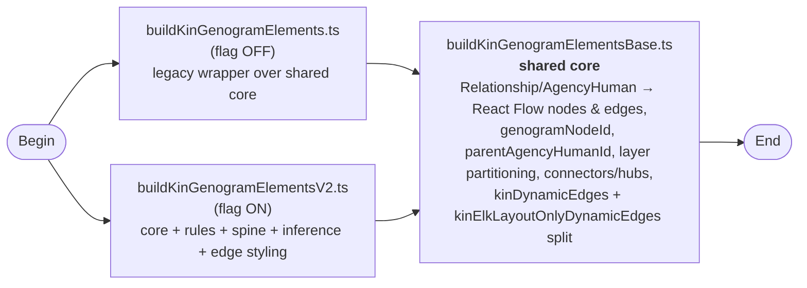
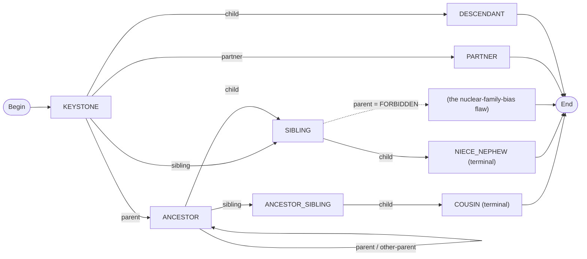
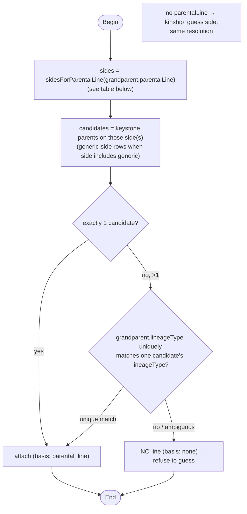
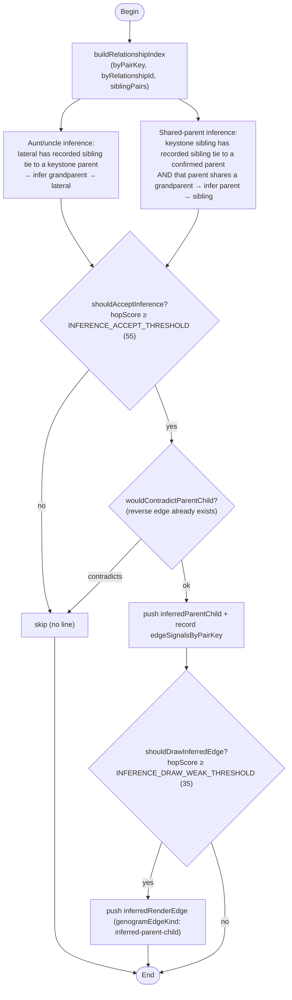
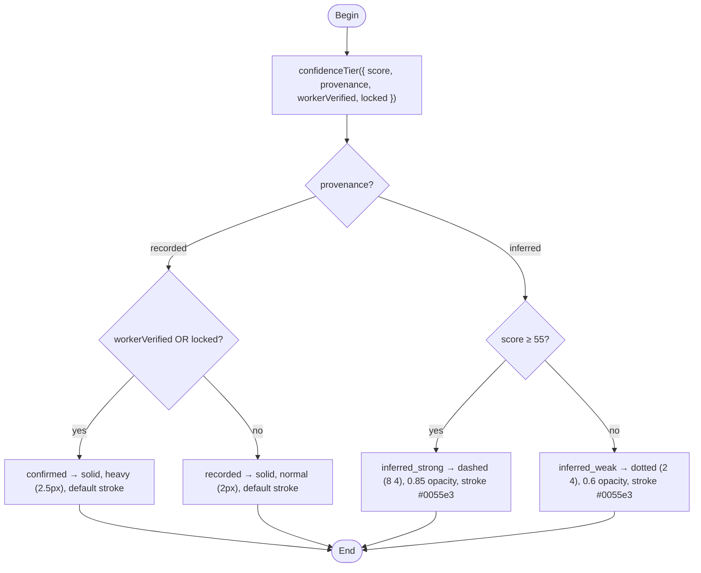
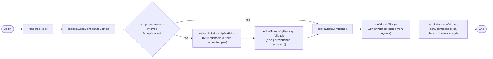
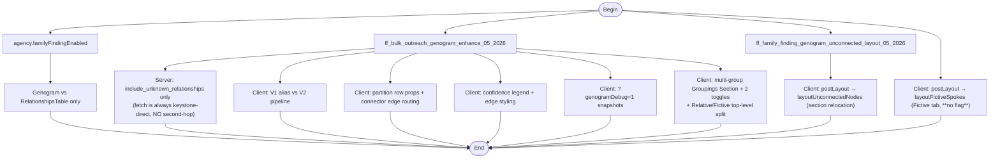

# Genogram module

Living reference for how a genogram page request becomes a rendered, confidence-scored graph — architecture, data flow, feature flags, and implementation notes. The code lives in `app/javascript/components/family_finding/genogram/` (server pieces under `app/graphql/` and `app/services/`); see the file index in §13.

> **Shadow copy (pre–chunk G):** maintained at `.local/genogram/docs/features/genogram.md` until promoted to `docs/features/genogram.md` in chunk G. Record deltas in `.local/genogram/doc-changelog.md`.

> **Rollout status:** **Phase 1 complete** (2026-06-24) — chunks A, B, C, H, D merged to `origin/main`. **Phase 2 in progress:** kickoff follow-ups **ENG-26390** (Honeybadger ELK fallback, [#21771](https://github.com/binti-family/family/pull/21771)) and **ENG-26391** (parental-line anchors, [#21772](https://github.com/binti-family/family/pull/21772)) merged 2026-06-25; chunk **E** ([ENG-26389](https://binti.atlassian.net/browse/ENG-26389), [#21767](https://github.com/binti-family/family/pull/21767)) open — V2 compiler/engines land as unwired dead code (incl. `alignLineageSpine.ts`, moved E ← F). F → G follow. V2 enhance flag remains **off** in production; Fictive compact spokes (H) are live without a flag.

- **Primary flag:** `ff_bulk_outreach_genogram_enhance_05_2026` (the "enhance" / V2 flag)
- Feature-flag bifurcations are marked **◇** in the diagrams.
- **Keep this doc current** when genogram behavior changes (edit the shadow copy + changelog).

Example URL:

```text
/admin/children/:child_id/relationships_dashboard?b64params=<base64>
```

Decoded `b64params` example: `{ "tab": "connections", "view": "genogram" }`

Optional query params (not Flipper):

| Param | Effect |
|-------|--------|
| `b64params.view=genogram` | Show genogram instead of relationships table |
| `b64params.subview=fictiveKin` | Fictive-kin subview inside genogram |
| `?genogramDebug=1` | Expose `window.__genogramDebugSnapshots` (requires enhance FF) |

---

## 1. End-to-end request flow

```mermaid
flowchart TB
  BEGIN(["Begin"])
  END(["End"])

  subgraph URL["Browser"]
    U1["GET /admin/children/:child_id/relationships_dashboard?b64params=…"]
  end

  subgraph Rails["Rails (server-render shell)"]
    R1["config/routes.rb → ChildrenController#relationships_dashboard"]
    R2["authorize child.agency_human :view_relationships?"]
    R3["relationships_dashboard.html.erb<br/>react_component('family_finding/RelationshipsDashboard')"]
  end

  subgraph Dashboard["RelationshipsDashboard.js"]
    D1["GraphQL Agency.graphql (familyFindingEnabled)"]
    D4{"◇ familyFindingEnabled?"}
    D5["RelationshipsTableOrGenogram.js"]
    D6["RelationshipsTable.js (table fallback)"]
  end

  subgraph ViewSwitch["RelationshipsTableOrGenogram.js"]
    V1{"◇ view === 'genogram' AND familyFindingEnabled?"}
    V2["Genogram.js"]
  end

  subgraph GenogramFetch["Genogram.js — data fetch"]
    G1["useQuery AgencyHumanGenogramData.graphql<br/>{ agencyHumanId: childAgencyHumanId }"]
    G2["Apollo → POST /graphql"]
  end

  subgraph GraphQL["GraphQL backend"]
    Q1["Queries::AgencyHumanGenogramData"]
    Q2["authorize agency_human :view_relationships?"]
    Q3{"◇ ff_bulk_outreach_genogram_enhance_05_2026<br/>(Flipper, current_user)"}
    Q4["fetch the keystone's OWN (direct) relationships<br/>ComputeAgencyHumanRelationships.call (both flag paths)<br/>NO second-hop expansion"]
    Q6["ComputeGenogramData.call → layers, childParentRelationships,<br/>siblingRelationships, partnerRelationships, fictiveKin<br/>(childParent/sibling structure rebuilt from keystone-network DB query;<br/>defensive keystone-only guard on fictiveKin + otherKinRelationships;<br/>◇ include_unknown_relationships = enhance FF)"]
    Q7["Types::GenogramData response<br/>(RelationshipGenogram fragment per row)"]
  end

  subgraph ClientCompile["Genogram.js — compile & layout"]
    C1["normalizeAgencyHumanGenogramData.ts"]
    C2{"◇ enhance FF (useFeatureFlag, client)"}
    C3["buildKinGenogramElements.ts (V1: thin alias over shared core)"]
    C4["buildKinGenogramElementsV2.ts (V2 pipeline)"]
    C5["nodes + dynamic/static/layout-only edges + diagnostics"]
  C6{"◇ subview === 'fictiveKin'?"}
  C7["fictiveKin spoke nodes/edges (spokeAndWheel)<br/>+ neutral Groupings band (Unknown / Not Connected) (V2)<br/>relatives + layout-only edges excluded here<br/>(spokes flagged compact for the tight wheel)"]
  C8["kin nodes/edges + GenogramConfidenceLegend (V2 only)"]
  C9["NodeDiagram.js"]
  C13["getLaidOutElements → elkjs layered layout"]
  C14{"◇ ff_family_finding_genogram_unconnected_layout_05_2026?"}
  C15["postLayout: fictive → layoutFictiveSpokes.ts (concentric wheel, **no enhance flag**);<br/>◇ enhance ON + Relatives → applySpineAlignment →<br/>layoutUnconnectedNodes.ts (Groupings Section)"]
    C16["ReactFlow render + custom node/edge components"]
  end

  BEGIN --> U1
  U1 --> R1 --> R2 --> R3 --> D1 --> D4
  D4 -->|no| D6
  D4 -->|yes| D5 --> V1
  V1 -->|no| D6
  V1 -->|yes| V2 --> G1 --> G2 --> Q1 --> Q2 --> Q3
  Q3 -->|OFF: include_unknown_relationships = false| Q4 --> Q6
  Q3 -->|ON: include_unknown_relationships = true| Q4 --> Q6
  Q6 --> Q7 --> C1 --> C2
  C2 -->|OFF| C3 --> C5
  C2 -->|ON| C4 --> C5
  C5 --> C6
  C6 -->|yes| C7 --> C9
  C6 -->|no| C8 --> C9
  C9 --> C13 --> C14
  C14 -->|OFF| C16
  C14 -->|ON| C15 --> C16
  C16 --> END
  D6 --> END
```



---

## 2. Compiler architecture: shared core + two entry points

The flag-OFF and flag-ON paths share one implementation. There is no forked
compiler — V2 **composes** the shared core, it does not replace it.



**Change-placement contract** (from `buildKinGenogramElements.ts` header):

- Bug fixes that must affect **both** paths → `buildKinGenogramElementsBase`.
- Net-new flag-ON behavior → `buildKinGenogramElementsV2` only.
- Extrication: when the flag wins, delete the V1 alias + the OFF branch in
  `Genogram.js`; if it loses, delete V2. The shared core stands alone either way.

**Layout-only edge split (shared core):** `buildKinGenogramElementsBase` routes
phantom same-generation rows, cousin-alignment helpers, and multi-parent hub
step edges into `kinElkLayoutOnlyDynamicEdges` (ELK layout hints that should not
render as visible relationship lines). V2 passes both buckets to `NodeDiagram`
(`dynamicEdges` + `elkLayoutOnlyDynamicEdges`).

**Phased rollout (chunk D → G):** until chunk G wires
`elkLayoutOnlyDynamicEdges` on `Genogram.js`, the flag-OFF legacy wrapper
**selectively folds** `kinElkLayoutOnlyDynamicEdges` back into `kinDynamicEdges`
— phantom rows and cousin-alignment helpers only. Multi-parent hub hops
(`multi-parent-connector-hub`, `multi-parent-hub-child`) stay out of
`kinDynamicEdges` on V1 (direct `multi-parent-connector` → child only, matching
`origin/main`). Hub **nodes** (`childrenHubNode`) are also **stripped** from
`kinNodes` in the legacy wrapper — with hub edges excluded, orphan 1×1 vertices
would otherwise reach ELK with no incident dynamic edges. When G lands, restore
the pass-through wrapper and wire layout-only edges on `Genogram` (requires
chunk B's `NodeDiagram` prop).

**Multi-parent hub nodes (chunk D):** the shared core emits `childrenHubNode`
scaffolding for two-parent children (V2 ELK routing). Flag-off V1 strips them
in `buildKinGenogramElements` before `Genogram.js`; `ChildrenHubNode` remains
registered in `customNodes` as defense-in-depth (invisible handles, same
pattern as `ConnectorNode`).

**Ascendant attachment (chunk D):** when the keystone has multiple parents on
one side, lineage-aware matching runs first; if it cannot uniquely resolve,
attachment falls back to legacy `motherId`/`fatherId` (last row wins) for
flag-off V1 parity with `origin/main`.

**Phase 2 — parental-line anchors ([ENG-26391](https://binti.atlassian.net/browse/ENG-26391), PR [#21772](https://github.com/binti-family/family/pull/21772), merged 2026-06-25):** standalone `parentalLine: "parental"` is the **non-binary parent line** (`Relationship::PARENTAL_LINES` / UI “Parental (Non Binary)”), not “both sides” (`maternal_and_paternal` is the explicit both-sides compound). **`genogramParentLineAnchors.ts` side mapping corrected:** standalone `parental` → `genericParentId` only; compounds `maternal_and_parental` / `parental_and_paternal` include the `generic` side (not collapsed to maternal+paternal). V1 last-wins fallback unchanged. **Still deferred to chunk G:** Chris’s proposal to attach ascendants/siblings to **concrete parent nodes** (real or phantom) instead of side → candidate list → `lineageType` disambiguation → last-wins fallback — especially for `# mothers ≠ 1` / `# fathers ≠ 1`.

**Supplemental parent-child merge (chunk D):** layer rows with direct
parent/child kinships that are **not** already in server
`childParentRelationships` are derived with naive kinship direction and merged
into `childParentGroupsByChildId` alongside server rows (deduped by
`relationshipDedupKey`). Server rows win directionality — supplemental derivation
skips any relationship the server already accounts for (keystone-aware
`ComputeGenogramData#child_id_for_parent_child_row` vs naive layer direction).

**Sibling inference invariant (chunk D, Bugbot #21637):** when deciding whether
a keystone-adjacent sibling already has explicit parents (and therefore whether
to infer keystone parents onto them), `parentRowsForChildId()` must read the
**merged** `childParentGroupsByChildId` map — **not** server-only
`childParentRelationships` groups. Supplemental-only parent rows (e.g. a mother
row on a layer band keyed to the sibling) must suppress keystone-parent
inference and route through explicit `sibling-via-parent-line` / connector edges
instead. Both V1 and V2 inherit this via the shared core; Phase 2 must not
reintroduce server-only parent lookup if sibling attachment logic is moved.

**Multi-parent connector ids (chunk D, Bugbot #21637):** `connector-<p1>-<p2>`
and `children-hub-<p1>-<p2>-<child>` ids must sort parent ids with
`compareGenogramNodeIds` (numeric `localeCompare`), not default `Array.sort()`.
Inferred sibling attachment looks up the existing connector using the same sort;
a lex vs numeric mismatch skips the shared `sibling-shared-parent-connector`
path. Ascendant attachment chaining (`resolveAscendantAttachmentTarget`) uses
the same comparator when walking multi-parent hops.

**V1 ELK model order (chunk D, Bugbot #21637):** the shared base seeds
`elkModelOrderIndex` on kin nodes (for V2 ordering passes). Flag-off V1 on
`origin/main` never set this field; if left on, `NodeDiagram` enables ELK
`considerModelOrder` constraints and can change layout vs pre-refactor. The legacy
wrapper strips `elkModelOrderIndex` from `kinNodes` before return (same interim
pattern as hub-node strip until chunk G).

---

## 3. V2 pipeline (flag ON) — detailed

`buildKinGenogramElementsV2(args)` runs the shared core first, then layers the
semantic model, spine, inference, generation solve, edge styling, and ordering
passes on top. Every step below is V2-only.

```mermaid
flowchart TB
  BEGIN(["Begin"])
  END(["End"])

  A0["<b>Accept compiler input</b><br/>args: layers, childParentRelationships, siblingRelationships,<br/>partnerRelationships, fictiveKin, keystoneAgencyHuman"]

  A2["<b>Build base nodes and edges</b><br/>buildKinGenogramElementsBase (shared core)<br/>→ legacyResult: kinNodes, kinDynamicEdges, kinStaticEdges,<br/>kinElkLayoutOnlyDynamicEdges, connectorEdges, fictiveKin*"]

  B1["<b>Model relationships as a family graph</b><br/>buildSemanticFamilyGraph (genogramRulesEngine)<br/>parentChild constraints + sibling/partner/co-parent pairs<br/>+ layer hints (incl. great-aunt vertical hint)<br/>+ contradiction pruning → graphIssues"]

  S1["<b>Classify spine roles (pre-inference)</b><br/>computeKeystoneSpine (initial)<br/>roleByNodeId for inference seeding"]

  I1["<b>Infer missing parent–child links</b><br/>inferLineageEdges (genogramInferenceEngine)<br/>confidence-gated aunt/uncle &amp; shared-parent inference<br/>→ inferredParentChild, inferredRenderEdges,<br/>edgeSignalsByPairKey, relationshipIndex"]

  M1["<b>Apply inferred links to graph</b><br/>mergeInferredParentChildIntoGraph<br/>baseGraph + accepted inferred edges → graph"]

  G1["<b>Resolve generation per person</b><br/>solveFamilyGenerations<br/>fixed-point generation solver → solution + issues"]
  G2["<b>Assign generation layout rows</b><br/>applySolvedGenerationsToKinNodes<br/>generation → ELK partition; projection issues"]

  S2["<b>Compute final tree membership</b><br/>computeKeystoneSpine (final, inference-aware)<br/>→ spineNodeIds, inferredNodeIds"]
  S3["<b>Identify groupings candidates</b><br/>unconnectedNodeIds = graph.nodeIds − spineNodeIds"]

  E1["<b>Reduce duplicate dynamic edges &amp; score confidence</b><br/>dynamic edges:<br/>reduceRenderedDynamicEdges → collapseFullSiblingLinesIntoConnector → pruneEdgesReferencingUnconnected<br/>+ inferredRenderEdges<br/>→ applyConfidenceStylesToEdges<br/>→ dropContradictoryParentChildEdges<br/>→ dropParentChildEdgesWithGenerationViolations"]
  E2["<b>Reduce redundant static edges &amp; score confidence</b><br/>static edges:<br/>prune → dropLateralSiblingEdgesWithSharedParent → applyConfidenceStylesToEdges"]
  E3["<b>Prepare layout-only scaffolding</b><br/>layout-only edges:<br/>reduceSameGenerationAlignmentForKeystoneSiblings → prune<br/>+ anchorDisconnectedSpineNodesToKeystone"]

  O1["<b>Order nodes for readable layout</b><br/>ordering passes:<br/>enforceAdjacencyPrecedenceOrderIndices (Partner &gt; Co-parent &gt; Sibling)<br/>→ enforceBranchCohesionOrderIndices<br/>→ centerLineageSpineOrderIndices (buildAdjacencyBlocks → joinBlocksAtEndpoints)<br/>→ centerConnectorAndHubOrderIndices"]
  O2["<b>Remove synthetic nodes for unconnected people</b><br/>prune synthetic helper nodes referencing unconnected ids"]

  OUT["<b>Return compiled graph</b><br/>kinNodes, kinDynamicEdges, kinStaticEdges,<br/>kinElkLayoutOnlyDynamicEdges, connectorEdges,<br/>unconnectedNodeIds, spineAlignmentPlan, diagnostics"]

  BEGIN --> A0 --> A2 --> B1 --> S1 --> I1 --> M1 --> G1 --> G2 --> S2 --> S3
  S3 --> E1 --> E2 --> E3 --> O1 --> O2 --> OUT --> END
```



### 3.1 Why the spine is computed twice

`computeKeystoneSpine` runs once **before** inference (to provide `roleByNodeId`
so the inference engine knows which nodes are ancestors / ancestor-siblings), and
once **after** inference + generation solve (to produce the final
`spineNodeIds`, now including any inferred ancestors).

---

## 4. Semantic graph + generation solver (`genogramRulesEngine.ts`)

Turns raw rows into a direction-aware family graph, then solves a generation
number per node.

### 4.1 `buildSemanticFamilyGraph`

- **`parentChildFromChildParentRows`** + **`parentChildFromLayers`** → directed
  `ParentChildConstraint[]`.
  - **`resolveDirectedParentChildFromChildParentRow`** is the key correctness
    gate: it uses kinship direction + youth-vs-adult `childId` on the
    AgencyHuman to reject rows keyed under the wrong person, so a `mother`-row
    keyed under the mother (instead of the child) is dropped rather than
    inverted.
- **`pruneContradictoryParentChildConstraints`** — when both `A→B` and `B→A`
  exist, keep the higher-confidence direction (`parentChildConstraintConfidence`,
  a solver-local score distinct from the edge display score) and emit
  `contradictory_parent_child_pruned`.
- **Layer hints** encode each node's generation relative to the keystone. Only
  **keystone-anchored** rows contribute a hint; lateral ties between two
  non-keystone people do not (prevents an aunt being dragged onto the keystone
  row). `aunt/uncle/great_aunt/great_uncle` anchored to the keystone are pinned
  to the **parent band** (offset −1), fixing great-aunts rendering a generation
  too low.
- Also collects `siblingPairs`, `partnerPairs`, `coParentPairs`,
  `keystoneGrandparentIds`, `keystonePeerIds`.

### 4.2 `solveFamilyGenerations`

Fixed-point solver over parent→child deltas and same-generation unions
(siblings/partners). Emits diagnostics: `constraint_cycle`, `hint_mismatch`,
`parent_child_generation_violation`, `same_generation_violation`,
`keystone_peer_generation_violation`.

### 4.3 `applySolvedGenerationsToKinNodes`

Projects generation → `layoutOptions["partitioning.partition"]`
(`KEYSTONE_PARTITION + generation`) and assigns `elkModelOrderIndex` for stable
in-row ordering. Returns projection `issues`.

---

## 5. Keystone lineage spine (`keystoneLineageSpine.ts`)

Defines tree membership. A node is on the spine iff reachable from the keystone
by a **typed, direction-aware** traversal; everyone else becomes a potential
connection.



- **Seeds:** the keystone, plus anyone with a **direct recorded lineage
  kinship** to the keystone (parent/child/sibling/grandparent/aunt/uncle/…).
  Direct `unknown`/`other` kinships do **not** seed (→ potential connection).
- **The one forbidden move:** from a SIBLING, never climb to that sibling's
  parent (that parent is not the keystone's lineage).
- **Inferred ancestors** accepted by the inference engine (§6) are added to the
  spine and tracked in `inferredNodeIds`.
- A direct keystone aunt/uncle with no parent to anchor to still renders in the
  parent band with no drawn line, kept in the keystone's ELK component via
  `anchorDisconnectedSpineNodesToKeystone` (invisible layout-only edge).

### 5.1 Ascendant → parent attachment (`genogramParentLineAnchors.ts`)

An `ascendant-parent-line` is a single-generation hop from a grandparent to one
of the keystone's parents. Gated to **immediate grandparents only**
(`IMMEDIATE_GRANDPARENT_ASCENDANT_KINSHIPS`); great-grandparents+ draw no line
(which intermediate ancestor they parent is not in the data) and float in their
own band.

`motherFatherAnchorsForChild` builds `KeystoneAnchors`: the legacy single
`motherId`/`fatherId`/`genericParentId`, **plus** a `parents[]` list of every
keystone parent as `{ id, side, lineageType }` (side from the parent's kinship:
mother→maternal, father→paternal, parent→generic).

`resolveAscendantParentAttachment(relationship, anchors)` picks the target
parent(s):



**`sidesForParentalLine` mapping** ([ENG-26391](https://binti.atlassian.net/browse/ENG-26391), merged 2026-06-25):

| `parentalLine` | Side(s) searched |
|----------------|------------------|
| `maternal` | maternal |
| `paternal` | paternal |
| `parental` | **generic** (non-binary parent line — not “both sides”) |
| `maternal_and_paternal` | maternal + paternal |
| `maternal_and_parental` | maternal + **generic** |
| `parental_and_paternal` | **generic** + paternal |

- **Multiple same-side parents** (e.g. adopted + biological mother): the
  grandparent is matched to the parent sharing its `lineageType`; only a UNIQUE
  match draws a line, otherwise NONE (the "no guessing when ambiguous" rule). So
  bio grandparents sit over the bio parents and adopted grandparents over the
  adopted parents, rather than guessing across lineages.
- **Single mother/father:** one candidate per side → unchanged behavior.
- Legacy callers that pass only `motherId`/`fatherId` (no `parents[]`) fall
  through to the original single-anchor path.

### 5.2 Post-layout spine straightening (`alignLineageSpine.ts`)

Runs in `postLayout` when the enhance FF is on (V2 relatives tab), after ELK and
before the Groupings Section relocation when that flag is also on. ELK lays out each generation's x-coordinates semi-
independently, so the keystone's ancestors zig-zag and couple drop-lines jog.
`buildSpineAlignmentPlan` walks the spine bottom-up (keystone → parents →
grandparents …); `applySpineAlignment` then, per couple:

- translates the whole parent row rigidly so the couple's center-midpoint lands
  over the children's sibling-bar center (`targetX`), keeping intra-row spacing;
- **re-centers the couple's `connectorNode` on `targetX`** so the two
  parent→connector legs are symmetric and the single connector→child drop is
  vertical.

Three subtleties:

- **Work in node CENTERS, not `position.x` (top-left).** Person/child nodes are
  full-width; the `connectorNode` is ~0-width, so its `position.x` already IS its
  center. Computing midpoints from left edges put the connector ~half a card
  width off. Midpoints now use `position.x + width/2`.
- **Re-center the connector even when the row delta is ~0.** When ELK already
  centered the couple over the child, the row needn't move, but ELK often still
  parks the connector under one parent — so the connector is anchored on
  `targetX` absolutely (not `+= delta`), and the per-step early-return on ~0
  delta was removed.
- **Supply `nodeWidth` — ELK output has no width at post-layout time.** This was
  the actual reason the first two fixes had no live effect. `getLaidOutElements`
  returns laid-out nodes with `width: null`, and React Flow has not measured them
  yet when `postLayout` runs, so `node.width` / `node.measured.width` are both
  unavailable. Without a fallback every `width` was 0 and `centerXOf` silently
  collapsed back to the left edge. `Genogram.js` now threads
  `context.layout.nodeWidth` (200) into `applySpineAlignment`; `widthOf` uses it
  as the fallback for real cards and keeps synthetic scaffolds (`connectorNode` /
  `childrenHubNode`) at 0 width by node `type`. (Lesson: unit tests that hardcode
  `width` cannot catch this — the regression test now models the real
  `width: null` ELK shape.)

Note: grandparents→parent never needed this — that band uses DIRECT
`ascendant-parent-line` edges (grandparent→parent), not a connector node, so it
was already clean. The connector pattern is only used for couples parenting the
spine child (e.g. the keystone's parents). Children-hub nodes are layout-only and
left untouched.

### 5.3 Fictive Kin compact spoke & wheel (`layoutFictiveSpokes.ts`)

Runs in `postLayout` on the **Fictive Kin tab** whenever `isFictiveKinView` is
true — **not gated** by `ff_bulk_outreach_genogram_enhance_05_2026` (shipped in
chunk **H**, ENG-26258). Replaces ELK's `radial` output for the wheel. The
fictive view is a depth-1 star (keystone center, every fictive person on one ELK
ring), so the ring's circumference — and the canvas — grows linearly with the
count. A keystone with ~100+ fictive ties produced a single huge ring and an
unusably large canvas.

`layoutFictiveSpokes` repositions the wheel into **concentric rings**:

- Keystone centered on the origin; spokes sorted **alphabetically** by displayed
  name (`determineName`, same as the Groupings Section).
- `planFictiveRings` greedily fills each ring to the circumference it can hold
  (`floor(2πR / (spokeWidth + angularGap))`) before stepping outward by
  `spokeHeight + ringGap`. Inner rings hold fewer cards than outer rings.
- Adjacent rings are angularly interleaved (offset by half the previous ring's
  step) so cards do not line up radially.
- The neutral Groupings band (`excludeIds`) and hidden nodes keep their incoming
  positions; the subsequent `layoutUnconnectedNodes` pass still relocates the
  band below the wheel. (`postLayout` was restructured so the repositioned wheel
  survives even when there is no band to relocate.)

Spoke cards also render **compact** (`Connection` `compact` prop → 150px-wide
card, smaller avatar; `Connection.module.scss .compact`). `Genogram.js` flags
fictive `personNode`s with `data.compact` and feeds the matching
`FICTIVE_SPOKE_WIDTH/HEIGHT` (150 × 132) into the ring math; the keystone
(`childNode`) stays full-size.

This collapses the wheel to a fraction of the single-ring footprint (roughly an
order of magnitude less area for large fictive counts). Pure module unit-tested
in `layoutFictiveSpokes.spec.ts`.

---

## 6. Confidence-gated inference engine (`genogramInferenceEngine.ts`)

Additive and confidence-gated: worst case is "no inferred line", never a wrong
solid line.



- **`scoreSiblingInference`** scores the supporting sibling row via
  `scoreEdgeConfidence`, but **excludes `parentalLine`** so display-scoring
  tweaks never shift inference accept/draw thresholds.
- Spaghetti guard: never infer from an already-inferred tie, never create a
  parent-child contradiction, never infer below threshold.
- **What data triggers inference:** both rules require a `sibling`-kinship
  relationship row BETWEEN two relatives (R1: aunt/uncle recorded as
  sibling-of-a-parent; R2: keystone-sibling tied to a parent). Workers record
  these relative-to-relative ties via the **"Add/Edit Other Relationships for
  [Person]"** flow (`EditOtherRelationshipsModal` → `UpdateRelationshipsForConnection`
  → `Services::Relationships::Create`), which allows the four 1-degree kinships
  **parent / child / sibling / partner** (`VALID_ONE_DEGREE_RELATIONSHIPS`) and
  stores a global person↔person `relationships` row (the child is NOT an
  endpoint) plus a `relationships_child_agency_humans` join row scoping it to the
  current child. These reach the engine via the keystone-network join-table query
  (§12), not a second-hop fetch: the frontend feeds `siblingRelationships` into
  `buildRelationshipIndex` (`IDX`), so `lookupRelationshipForPair(aunt, mother)`
  finds the sibling row and R1/R2 fire.
- **Why inferred edges are rare in practice:** most children have no
  worker-created `sibling`-between-relatives rows, so the engine produces no
  inferred lines even though the capability is live. To exercise it, open a
  relative's card → "Add/Edit Other Relationships" → record the aunt as
  **sibling** of the mother. The render path is proven by
  `genogramEdgeConfidence.spec.ts`.

---

## 7. Confidence scoring + edge styling

### 7.1 Scoring model (`genogramInferenceConfidence.ts`)

`EdgeConfidenceSignals` → `scoreEdgeConfidence` → number.

| Input | Effect |
|-------|--------|
| `provenance` | `recorded` base 50 / `inferred` base 20 |
| `lineageType` | `biological 40 … unknown 5` (via `scoreLineageType`) |
| **vertical default** | blank `lineageType` on a direct parent/grandparent-line kinship → scored as `biological` (`effectiveLineageType`); laterals never assumed |
| `verificationSource` | `worker` +25, else −5 |
| `locked` | +15 |
| `parentalLine` | maternal/paternal/parental +5 (display only) |
| `hopScores` (inferred) | score = `min(hopScores)` (weakest link) |

Tiering is **provenance-first** — a recorded relationship is always solid; only
inferred edges are dashed/dotted:



`edgeStyleForTier(tier)` maps tier →
`{ strokeWidth, opacity, strokeDasharray?, stroke? }`. Both inferred tiers carry
`stroke: "#0055e3"` — the primary-action "Binti blue" (`$colors-emphasis-600`),
inlined as hex because React Flow applies the edge `style` object directly to the
SVG path — so the dashed/dotted lines match the blue "(inferred)" card label
(§10). Confirmed/recorded omit `stroke` and keep React Flow's default neutral.

> **Implication:** a fully-recorded tree with no `lineageType`/verification
> renders **all solid `recorded`** — recorded ties are never mislabeled as
> inferred. Dashed/dotted appears only when the engine actually inferred a link.

### 7.2 Application (`genogramEdgeConfidence.ts`)

`applyConfidenceStylesToEdges` is applied to dynamic + static edges:



Only `HIERARCHY_KINDS` (parent-child, multi-parent-connector,
ascendant-parent-line, sibling-via-parent-line, lateral, inferred-parent-child,
…) and `fictive-kin` are styled; pure layout scaffolding is left untouched.

### 7.3 Legend (`GenogramConfidenceLegend.tsx`)

Rendered beside the diagram, `enabled` only when the enhance FF is on and not in
fictive-kin view. i18n under `relationships.genogram.confidence_legend` (en.yml).

Rows shown:
- **Solid - recorded relationship** (always). The `confirmed` (worker-verified /
  locked, stroke 2.5) and `recorded` (stroke 2) tiers are BOTH solid and were
  collapsed into this one legend row; the engine still draws the two stroke
  widths, the legend just no longer splits them.
- **Dashed - inferred from strong recorded ties** and **Dotted - low-confidence
  inferred connection**: shown ONLY when the relatives tree actually contains an
  `inferred-parent-child` edge. Their swatches are tinted
  `border-top-color: $colors-emphasis-600`
  (`GenogramConfidenceLegend.module.scss`) to match the blue inferred lines.
  `Genogram.js` derives
  `hasInferredEdges = kinDynamicEdges.some(genogramEdgeKind === "inferred-parent-child")`
  and passes it to the legend.

Why conditional: dashed/dotted are produced ONLY by the inference engine (§6)
(the ascendant gendered-guess dotted path is OFF —
`AMBIGUOUS_ASCENDANT_PARENT_LINE_MODE = "suppress"`), and inference needs a
recorded sibling-to-parent row that keystone-anchored data rarely has, so most
trees show no dashed/dotted rows. End-to-end style mapping (recorded→solid,
inferred_strong→dashed "8 4", inferred_weak→dotted "2 4") is locked by
`genogramEdgeConfidence.spec.ts`; the conditional rows by
`GenogramConfidenceLegend.spec.tsx`.

### 7.4 Pruning edges into the unconnected set (`pruneEdgesReferencingUnconnected`)

Applied to all three edge buckets (dynamic / static / layout-only). For a plain
edge it drops the edge when **either endpoint** references an unconnected id —
`endpointReferencesUnconnected` matches the raw id **or any `-`-split token**,
so a sibling-lateral / phantom-alignment row that names a potential connection
is detached cleanly.

**Multi-parent connector clusters are special-cased** (`shouldKeepConnectorClusterEdge`).
A cluster fans one child off a shared `connector-<p1>-<p2>…` node that represents
the child's whole **parent set**, so the connector/hub ids embed every co-parent.
The plain token heuristic therefore over-pruned: if *any* co-parent was a
potential connection, the connector token matched and the **connected** parent's
line to the child vanished too (e.g. half-siblings co-parented by an on-spine
mother + an off-spine father lost the mother's line entirely). Instead, for the
`multi-parent-connector` / `multi-parent-connector-hub` / `multi-parent-hub-child`
/ **`sibling-shared-parent-connector`** kinds (the last is the single
`connector → child` drop emitted by §7.6 after collapsing a full sibling's
per-parent legs):

- **child unconnected** → drop the whole cluster (unchanged: no line crosses into
  the relocated section).
- **child on spine, ≥1 parent on spine** → keep the `connector → child` line and
  the layout-only hub spine; for each `parent → connector` leg, keep it **only if
  that specific parent is on the spine** (drop just the unconnected co-parent's leg).
- **child on spine but every parent unconnected** → drop the cluster (no connected
  parent to anchor to; avoids a connector dangling from nothing).

Parents are read from the connector id (`parseConnectorParentIds`, reliable since
AgencyHuman ids have no internal `-`); the leg's own parent and the child come
from `data.parentAgencyHumanId` / `data.childAgencyHumanId`. Covered by the
`pruneEdgesReferencingUnconnected — multi-parent connector clusters` specs
(including `sibling-shared-parent-connector` drops after §7.6 collapse).

### 7.4.1 Pruning synthetic helper nodes (O2)

After edge pruning, V2 drops hyphenated **synthetic** nodes (connectors,
children hubs, phantoms) that only scaffold unconnected people. Pure AgencyHuman
ids (no `-`) are never dropped here — those person nodes relocate downstream.

**Connector / hub nodes mirror the §7.4 cluster rules** (`shouldKeepSyntheticNodeForUnconnected`):
keep a `connector-<p1>-<p2>…` or `children-hub-<p1>-…-<child>` node when the
encoded child is on the spine and **at least one** co-parent is connected; drop
when the child is unconnected or every co-parent is unconnected. This avoids the
plain token heuristic (`any embedded id is unconnected → drop`) removing a
shared connector that a connected co-parent's child still needs.

Other hyphenated scaffolds (e.g. `<p1>-<p2>-phantomNode`) still drop when **any**
embedded person id is unconnected.

The base compiler receives **raw** `childParentRelationships` from GraphQL;
mis-grouped rows are filtered only inside `buildSemanticFamilyGraph`
(`resolveDirectedParentChildFromChildParentRow`), so the shared core can still
emit parent-child edges via `parentAgencyHumanId` when the rules engine cannot
orient a row.

### 7.5 Dropping lateral sibling lines made redundant by inference (`dropLateralSiblingEdgesWithSharedParent`)

Applied to the **static** edge bucket (`prunedStaticEdges`), after
`pruneEdgesReferencingUnconnected`.

The base builder draws a direct `lateral` sibling line (`e<h1>-<h2>`, from
`addPhantomSameGenerationRelationship`) only when the two siblings have **no
recorded shared parent** — when they do, the shared-parent fan / parent lines
express the tie and the lateral is suppressed at base-build time
(`buildKinGenogramElementsBase.ts`, the `else` branch ~1572-1584). The
"explicit parent rows" check uses **merged** `childParentGroupsByChildId`
(server + supplemental layer rows; see §2), not server-only groups. But the
lineage **inference** (§6) runs after the base build and can add a
`parent → child` fact to `graph.parentChild` (e.g. an inferred grandmother→aunt
line whose grandmother is already a recorded parent of the keystone's parent).
Once that lands, the two siblings share a **common parent**, the sibling tie is
expressed through the hierarchy (recorded parent line + dashed inferred line),
and the leftover lateral renders as a redundant near-parallel duplicate of the
inferred drop line.

`reduceRenderedDynamicEdges` already drops redundant `sibling-via-parent-line`
**dynamic** edges, but not a **static** lateral made redundant by an **inferred**
shared parent. So `dropLateralSiblingEdgesWithSharedParent` is purely
subtractive: it drops a static edge with `genogramEdgeKind: "lateral"` +
`lateralKinship: "sibling"` iff its two endpoints share ≥1 common parent in the
post-inference `graph.parentChild`. It only fires when a real shared parent
exists, so a half-sibling with no shared parent keeps its lateral connector
(dropping it would orphan them from the keystone). Partner laterals and
non-lateral edges are untouched. Static edges aren't used by ELK and the inferred
edge IS a dynamic (ELK) edge, so **layout is unchanged** — only the redundant
solid line is removed. Covered by the
`dropLateralSiblingEdgesWithSharedParent` specs.

### 7.6 Collapsing a full sibling's per-parent legs into one connector drop (`collapseFullSiblingLinesIntoConnector`)

Applied to the **dynamic** edge bucket, right after `reduceRenderedDynamicEdges`
and before `pruneEdgesReferencingUnconnected`.

The base builder draws one `sibling-via-parent-line` **per parent** when a
sibling has its OWN explicit recorded parent rows (`siblingParentTargets.length > 0`),
but routes a sibling through the shared `sibling-shared-parent-connector` when the
parents are only inferred from the keystone's. So a **full sibling** whose two
explicit parents are the very couple that already owns a `connector-<p1>-<p2>`
node renders as TWO long legs fanning out of each parent — inconsistent with the
keystone (and connector-inferred siblings) that hang off the single connector
drop. Those duplicate legs are the "extra lines from mother and father."

`collapseFullSiblingLinesIntoConnector` groups `sibling-via-parent-line` edges by
child; when a child's parent SET (2+ sources) exactly matches an existing
connector's parent set (`connectorParentSetsFromNodes` reads them from
`connectorNode` ids), it drops those legs and adds ONE
`sibling-shared-parent-connector` edge `connector → child`. That rewritten drop
uses the same selective keep rules as §7.4 connector clusters during
`pruneEdgesReferencingUnconnected` (not the plain token heuristic). Half-siblings (no
matching connector) and single-parent legs are left alone. It is a render-edge
rewrite only: the child stays connected to the tree via the connector, so ELK
layout and spine reachability are preserved. Covered by the
`collapseFullSiblingLinesIntoConnector` specs.

### 7.7 Keeping a co-parent's sibling on the couple's outer edge (`joinBlocksAtEndpoints`)

`buildAdjacencyBlocks` (used by `centerLineageSpineOrderIndices`, §7 ordering
passes) groups a generation's connected person nodes into adjacency blocks by the
hard pairs (partner / co-parent / sibling). When a node belongs to MULTIPLE pairs
(e.g. a mother who is both a co-parent of the keystone and the sibling of an
aunt), the old merge **appended** the newly-merged block to the end regardless of
which endpoint the pair tied — so the aunt landed next to the WRONG co-parent.

That produced a model order (`MOM, DAD, sib`) that disagreed with the aunt's
**barycenter** (she hangs under a shared grandparent on the far side). Crucially,
ELK runs with `considerModelOrder = NODES_AND_EDGES` + `forceNodeModelOrder` as a
**soft** hint only — when model order conflicts with edge-driven crossing
minimization, **ELK reorders** (confirmed empirically: the grandparent row is also
reordered vs its model order). So ELK split the couple and wedged the aunt between
the co-parents (`MOM, sib, DAD`).

Fix: `joinBlocksAtEndpoints` orients each block merge so the two PAIRED endpoints
sit at the junction. It uses array **reversal**, which preserves every internal
adjacency, so all previously-merged hard pairs stay adjacent while a co-parent's
sibling attaches to the couple's **outer** edge. The resulting model order
(`[sib, MOM, DAD, dad's-sib]`) now AGREES with the barycenter, so ELK keeps it. If
an endpoint is interior to its block (cannot be brought to an edge by reversal),
the block is left as-is and adjacency degrades gracefully. Covered by the
`centerLineageSpineOrderIndices` spec "places a co-parent's sibling on the
couple's OUTER edge".

> **Layout lesson:** `elkModelOrderIndex` is a SOFT hint, not a hard constraint.
> Any ordering fix must make the model order AGREE with the edge-driven
> barycenter; setting indices alone is not enough. Verify against the real ELK
> output (React Flow node `style.transform` translate-x), never the model order.

### 7.8 Inferred kinship labels on the card (`genogramInferredKinship.ts`)

A tree person whose tie to the keystone is implied by lineage rather than recorded
directly (e.g. the keystone's parent's parent) would otherwise show "Unknown" on
the card. This pass derives and displays the implied kinship instead, tagged
"(inferred)".

- **Derivation (`genogramInferredKinship.ts`, pure):**
  - `buildGenderByNodeId(rows)` infers a person's gender from the gendered kinship
    terms recorded ABOUT them. A row means "source is `<kinship>` of dest", so a
    gendered term (`mother`/`grandfather`/`aunt`/…) reveals the **source's**
    gender; neutral terms (`parent`/`child`/`sibling`) leave it `unknown`.
  - `deriveInferredKeystoneKinshipToken({ role, generationDistance, gender })`
    maps a `SpineRole` (from §5) + |generation distance| (from the solver) +
    gender → a kinship **token**. Gendered token only when gender is known, else a
    gender-neutral token. ancestor → mother/grandmother/great_grandparent…,
    ancestor_sibling → aunt/uncle/great_aunt… (or the combined `aunt_or_uncle`),
    descendant, niece_nephew (or `niece_or_nephew`), sibling, cousin, partner.
    `keystone` and unmappable roles → null.
- **Wiring (`buildKinGenogramElementsV2.ts`):** builds the gender map from all
  relationship rows, takes `roleByNodeId` from the final spine, and
  `annotateInferredKeystoneKinship` tags each spine person node with
  `data.inferredKeystoneKinship = <token>`. Purely additive — only `data` gains a
  field, so layout is untouched; the keystone and synthetic nodes are skipped.
- **Render (`Connection.js`, §10):** shows the token (translated) + "(inferred)"
  in the inferred blue, but only when the card would otherwise read "Unknown".
- **Gender nuance:** a grandparent recorded as a `parent` (not `mother`) shows
  the neutral "Grandparent" (not "Grandmother"); laterals tied by the neutral
  `sibling` show "Aunt / Uncle". Recording a gendered term upgrades the label
  automatically.
- Covered by `genogramInferredKinship.spec.ts` (gender map + token derivation),
  `buildKinGenogramElementsV2.spec.ts` (annotation), and `Connection.spec.js`
  (display conditions).

---

## 8. Groupings Section + Relative/Fictive split

> This section supersedes the earlier "single flat band" design (D3/D4) — that legacy band only survives on
> the flag-OFF path.

The area below the Relation Tree that holds people who are **not placed in the
tree**. `postLayout` callback in `Genogram.js`, gated by
`ff_family_finding_genogram_unconnected_layout_05_2026`; the multi-group
classification, the two UI toggles, and the category split are all additionally
gated by the enhance FF (`ff_bulk_outreach_genogram_enhance_05_2026`). Flag-OFF
falls back to the single legacy band.

### 8.1 Top-level Relative ↔ Fictive split (enforced first)

The diagram has two tabs (`subview`): **Relatives** and **Fictive Kin**. The four
`RelationshipCategory` values map to the tabs before anything else renders:

- **Fictive Kin** → Fictive tab only (spoke-and-wheel spokes off the keystone).
- **Relative / Unknown / Not-Related** → Relatives tab (Relative in the tree;
  Unknown + Not-Related in the Groupings Section).

`Genogram.js` builds `fictiveKeystoneAgencyHumanIds` (everyone with a **direct
keystone** `fictiveKin` row). On the Relatives tab (V2), those ids are removed
from `nodeDiagramNodes` and from every edge/scaffold pass into NodeDiagram
(connectors/hubs whose ids reference a fictive person are dropped too).
`groupKeyByNodeId` also forces the same ids to `FICTIVE_GROUPING_KEY`, which is
in **no** view's render order — belt-and-suspenders for the Groupings Section.
So a person who is the keystone's Fictive Kin is hidden from the Relatives tab
even if they also appear in the relatives graph as a structural co-parent of a
sibling (e.g. the mother's paramour who is recorded as a sibling's father). Note: because the
genogram is now fed only the keystone's **direct** relationships (the second-hop
fetch was removed — see §11), unrelated people who used to leak in through a
fictive-kin person's own family (e.g. that paramour's child from another family)
no longer reach the payload at all.

### 8.2 Classification (`genogramGroupings.ts`)

`classifyGroupingKey({ kinshipRelationship })` → one of four groups (+ the
excluded Fictive sentinel), keyed off the kinship of the row that **anchors the
person to the keystone**:

| Group key | From kinship | Meaning / worker action |
|-----------|--------------|--------------------------|
| `KINSHIP_NOT_SPECIFIED` | `other`, `unknown_kinship_relationship` | Known relative, kinship not recorded → capture it |
| `RELATIVES_UNPLACED` | any specific relative kinship w/ no connecting path | Relative we can't position → add linking relationships |
| `RELATIONSHIP_UNKNOWN` | `unknown`, empty/missing | Unknown-category tie (PKOS potentials) → determine relationship |
| `NOT_CONNECTED` | `no_relationship` | Affirmatively not related → informational |
| `FICTIVE_GROUPING_KEY` *(sentinel)* | `fictive_kin` | Excluded from Relatives tab entirely (renders as Fictive spoke) |

`GROUPING_ORDER` renders them top-to-bottom **most-actionable first**:
KINSHIP_NOT_SPECIFIED → RELATIVES_UNPLACED → RELATIONSHIP_UNKNOWN → NOT_CONNECTED.
`VIEW_NEUTRAL_GROUPING_KEYS` = the two category-neutral groups
(RELATIONSHIP_UNKNOWN, NOT_CONNECTED) — the only groups shown on the Fictive tab.

**The toggle population is "no-line relatives", NOT `unconnectedNodeIds`.** This is
the key subtlety. A relative with a *specific* recorded kinship but no unambiguous
anchor is **placed on the tree, floating in its generation band with no connecting
line** (the spine's "no guessing when ambiguous" rule), so it is **not** in
`spineUnconnectedNodeIds`. Classifying only the spine complement therefore misses
these people entirely — a tree can have zero spine-complement `RELATIVES_UNPLACED`
nodes yet many aunts/uncles/cousins/great-grandparents floating with no line. So
`Genogram.js` computes the toggle population directly:

```
relativesWithNoLineNodeIds = real personNodes (numeric id) where
  • the node has NO visible connecting line — not the source/target of any
    kinDynamicEdge (incl. dashed inferred-parent-child edges) or kinStaticEdge
    (so "none known and none inferred"); AND
  • it is not Fictive to the keystone; AND
  • classifyGroupingKey(kinship-to-keystone) === RELATIVES_UNPLACED.
```

This spans both the floating-on-tree relatives and any genuinely spine-complement
ones. `groupingMemberIds = spineUnconnectedNodeIds ∪ relativesWithNoLineNodeIds`
feeds `groupKeyByNodeId`.

**Per-generation buckets.** When this population is shown in the section (toggle
on, see §8.3) it is **not** one flat group — it splits into per-generation buckets
so the section reads oldest→youngest. `groupKeyByNodeId` keeps the base
`classifyGroupingKey` result but, for `RELATIVES_UNPLACED` nodes, overrides the key
with `relativesUnplacedGenGroupKey(partition)` (where `partition` is the node's
`layoutOptions["partitioning.partition"]`), and uses the dormant-until-now
`getUnconnectedGenerationLabel(partition)` (in `buildKinGenogramElementsBase.ts`)
for the bucket header (*Great-Grandparent Generation*, *Grandparent Generation*,
*Parent Generation*, *Sibling Generation*, …). Buckets are ordered by ascending
partition (oldest ancestor first). Anyone whose generation can't be derived (no
partition / empty label) falls back to the flat `RELATIVES_UNPLACED` bucket,
rendered last. `isRelativesUnplacedGroupKey(key)` (flat key **or** any
`relatives_unplaced_gen_*` bucket) identifies the whole population. The other three
groups stay flat.

### 8.3 The two UI toggles (`InputCheckbox`, above the confidence legend)

Both rendered only when the enhance FF is on:

1. **"Show groupings section"** (`showGroupings`, default on) — master on/off for
   the whole section (e.g. for a clean printed/downloaded diagram). Off →
   `groupOrder = []` → every member hidden, no labels/separator.
2. **"Hide Relatives with Path Unknown"** (`hideRelativesWithPathUnknown`,
   default **off**, Relatives tab only) — a **placement switch** for the
   `relativesWithNoLineNodeIds` population (§8.2: specific-kinship relatives with no
   recorded/inferred line). (The label was previously the inverted-sounding
   "Include Child's Relatives with Path Unknown"; the label and state/param names
   were renamed to read honestly.)
   - **off** (default) → those people stay **on the tree** (floating in their
     generation row, no connecting line) — excluded from the relocation set.
   - **on** → they are **hidden from the tree** and moved **into the Groupings
     Section**, split into per-generation buckets (§8.2).
   `Genogram.js` builds the relocation set as `spineUnconnectedNodeIds` **plus**
   `relativesWithNoLineNodeIds` when on, and `spineUnconnectedNodeIds` **minus**
   `relativesWithNoLineNodeIds` when off (most of that population is on the tree,
   not in the complement, so the toggle must add them rather than just un-filter).
   This toggle stays visible even when the master toggle is off.

`groupingOrderForView({ isFictiveKinView, relativesUnplacedGroupKeys })` resolves
the rendered group set: Fictive tab → neutral groups only; Relatives tab → the
four-group order with the single `RELATIVES_UNPLACED` slot **replaced** by
`relativesUnplacedGroupKeys` (the caller's ordered per-generation buckets + any
flat fallback). `Genogram.js` passes the ordered buckets when the toggle is **on**
and `[]` when **off** (collapsing the slot so those people stay on the tree).

### 8.4 Layout (`layoutUnconnectedNodes.ts`)

- **Source of truth for membership:** V2 → spine complement
  (`spineUnconnectedNodeIds`), adjusted per view/toggle (Fictive →
  `neutralBandNodeIds`; Relatives + toggle-on → **plus** `relativesWithNoLineNodeIds`;
  Relatives + toggle-off → **minus** `relativesWithNoLineNodeIds`).
  Legacy → `Object.keys(connectorEdges)`.
- **Per group:** label node (`generationLabelNode`) in slot 0, members
  **alphabetized**, wrapped at `MAX_NODES_PER_ROW` (10), one blank row between
  groups.
- **Per-group cap** `MAX_SHOWN_PER_GROUP` (25) with an independent inline
  **"Show all N / Show fewer"** control (`unconnectedToggleNode`), driven by
  `expandedGroups` state in `Genogram.js`. (The old global D4 20-item cap is gone;
  capping is now per group.)
- One horizontal `separatorNode` between the tree and the section; section
  centered under the connected tree.
- Members whose group is filtered out (view/toggle) or all members (section off)
  are `hidden` so ELK does not strand them in the tree.
- Partition-anchor edges into relocated members are dropped so no lines cross the
  separator.

---

## 9. Diagnostics & debug

`buildKinGenogramElementsV2` returns a `diagnostics` object:

| Field | Meaning |
|-------|---------|
| `graphIssues` | from `buildSemanticFamilyGraph` (e.g. contradictory_parent_child_pruned) |
| `projectionIssues` | from generation projection (hint_mismatch, …) |
| `invariantIssues` | generation-ordering violations that survived |
| `layerHintMismatchCount` | count of hint mismatches |
| `renderedEdgeCountBeforeReduction` / `…AfterReduction` | edge-reduction effectiveness |
| `spineNodeCount` / `unconnectedNodeCount` | tree vs potential split |
| `inferredEdgeCount` | number of inferred render edges drawn |

With `?genogramDebug=1` **and** the enhance FF on, `Genogram.js` publishes
`window.__genogramDebugSnapshots = { featureFlagName, featureFlagEnabled,
compilerVariant, serverResponse, buildKinGenogramElements, normalizeAgencyHumanGenogramData }`.
Copy the object from the browser console to inspect compiler output offline.

### 9.1 NodeDiagram ELK layout fallback (`NodeDiagram.js`)

When `elkjs` layout throws, `getLaidOutElements` returns the **sanitized input
topology** (filtered edges, sorted nodes) instead of crashing the diagram —
genogram and other Heart consumers keep a renderable graph.

**Production monitoring ([ENG-26390](https://binti.atlassian.net/browse/ENG-26390), PR [#21771](https://github.com/binti-family/family/pull/21771), merged 2026-06-25):** the catch block **always** calls `Honeybadger.notify` (dynamic import of `@honeybadger-io/js` so HeartRails SSR does not load Honeybadger at barrel import time). Tags: `node-diagram`, `elk-fallback`. Context: `reason`, `errorMessage`, `errorName`, `graphDirection`, input/sanitized node and edge counts — **no** `droppedNodeIds` payload.

**Debug-only (unchanged):** when the caller passes `elkFallbackDebugEnabled={true}`
(`Genogram.js` does not today), the catch also appends a snapshot to
`window.genogramElkFallbackDebug` (ring buffer, last 25) and `console.error`s the
failure. Default is **off** — Honeybadger is the prod signal; the ring buffer is
for local/staging diagnosis only.

Covered by `NodeDiagram.spec.js` (Honeybadger notify on ELK failure; debug buffer
still gated).

---

## 10. Custom React Flow node/edge types

Rendered by `NodeDiagram` via `Genogram.js` → `customNodes`:

| Node type key | Module |
|---------------|--------|
| `personNode` | `ConnectionNode.js` → `Connection.js` (click → RelationshipModals) |
| `childNode` | `ChildNode.js` |
| `connectorNode` | `ConnectorNode.js` |
| `childrenHubNode` | `ChildrenHubNode.tsx` (multi-parent fanout, V2) |
| `separatorNode` | `SeparatorNode.tsx` (Groupings Section divider) |
| `generationLabelNode` | `GenerationLabelNode.tsx` (group header labels) |
| `unconnectedToggleNode` | `UnconnectedToggleNode.tsx` (per-group "Show all / Show fewer") |

Edges: `Connection.js` (step edges), `NodeDiagram/FloatingEdge.js`. Confidence
`style` is attached to edge objects and survives into ReactFlow rendering.

**Nameless-person fallback:** `displayNameWithFallback` (`sortRelationships.js`)
returns a localized **"Unnamed person"** when an AgencyHuman has no name, used by
both the card (`Connection.js`) and `ViewRelationshipModal.js` so a data-quality
artifact (a nameless record, e.g. an abandoned PKOS/manual entry) never renders
the raw i18n placeholder `[missing "%{name}" value]`.

**Inferred kinship label on the card (§7.8):** `Connection.js` shows the
keystone-relative kinship for a tree person whose card would otherwise read
"Unknown", with a second line **"(inferred)"** in `textColor="emphasis-600"`
(the same blue as the inferred lines). The card shows it whenever the relationship
displays as Unknown — no keystone tie, OR a keystone tie whose kinship is
`""`/`unknown`/`no_relationship`/`unknown_kinship_relationship` — and the node
carries a `data.inferredKeystoneKinship` token. A real recorded kinship (e.g.
"Mother") always wins. Tokens resolve from
`activerecord.enums.relationships.kinship_relationships.*`; the combined-neutral
tokens (`aunt_or_uncle`, `great_aunt_or_uncle`, `niece_or_nephew`,
`great_niece_or_nephew`) + the `suffix` from
`relationships.genogram.inferred_kinship.*`.

---

## 11. Feature flags — where they branch



| Flag | Checked in | OFF | ON |
|------|------------|-----|----|
| `agency.familyFindingEnabled` | `RelationshipsDashboard.js` | Table only | Genogram available when `view=genogram` |
| `ff_bulk_outreach_genogram_enhance_05_2026` | `agency_human_genogram_data.rb` | Keystone's direct relationships; Unknown/Not-Connected NOT surfaced | Same keystone-direct fetch (no second-hop); `include_unknown_relationships` surfaces Unknown/Not-Connected into `otherKinRelationships` |
| same | `Genogram.js` | V1 alias (shared core only) | V2 pipeline (rules + spine + inference + styling) |
| same | `Genogram.js` (Groupings) | Single legacy band | Multi-group Groupings Section + 2 toggles + Relative/Fictive split + fictive neutral band |
| same | `Genogram.js` (`postLayout`, Relatives) | No V2 spine straightening | V2 spine straightening after ELK |
| *(none — not flag-gated)* | `Genogram.js` (`postLayout`, Fictive tab) | Compact concentric spoke wheel (`layoutFictiveSpokes`) | Same (shipped chunk H; runs when `isFictiveKinView`) |
| `ff_family_finding_genogram_unconnected_layout_05_2026` | `Genogram.js` (`postLayout`) | No Groupings Section relocation | Relocates the Groupings Section below the separator |
| `?genogramDebug=1` | `Genogram.js` | No debug object | `window.__genogramDebugSnapshots` (requires enhance FF) |

> **Two-flag interaction:** `postLayout` is shared but each flag owns a slice.
> The **fictive spoke wheel is flag-free** (chunk H): it runs whenever the
> Fictive tab is active. The enhance FF runs V2 spine straightening on the
> Relatives tab only. The unconnected-layout FF runs Groupings Section
> relocation. With enhance on but layout off, members are classified and V2
> layout passes still run, but the section is not relocated below the tree.

---

## 12. Data shapes (reference)

**`RelationshipGenogram` fragment** (per row, both compiler paths consume it):
`id, source/destinationAgencyHuman {…, childId}, kinshipRelationship,
lineageType, parentalLine, verificationSource, locked,
additionalRelationshipDetails, emotionalRelationshipStatuses,
fictiveKinDescription, levelsOfSupport, updatedAt, permissions`.

**`GenogramData`** (query root): `keystoneAgencyHuman`, `layers { _1…_11,
otherKinRelationships }`, `childParentRelationships [{ childId, relationships }]`,
`siblingRelationships`, `partnerRelationships`, `fictiveKin`.

> The genogram is fed only the keystone's **direct** relationships
> (`ComputeAgencyHumanRelationships.call`); there is **no** second-hop expansion
> (it was removed — it added no tree structure for the keystone-anchored model and
> injected unrelated people + duplicate AgencyHumans). `ComputeGenogramData` still rebuilds the
> `childParentRelationships` / `siblingRelationships` / `partnerRelationships`
> structure from its own keystone-network DB query (`associations_to_child` over
> the `relationships_child_agency_humans` join table, scoped to the keystone + its
> siblings), so sibling→parent lines survive without second-hop. **This join-table
> query is also how worker-created person↔person ties from "Add/Edit Other
> Relationships for [Person]" reach the genogram** (the child is not an endpoint
> on those rows, so the keystone-direct fetch never sees them, but they carry a
> join row to the keystone). Those edge sets feed both the rendered edges and the
> inference engine's relationship index (§6) — child-isolated, no second-hop. It also
> filters `fictiveKin` and `layers.otherKinRelationships` to rows where the
> **keystone is an endpoint** (now a defensive guard, since the direct fetch
> already guarantees that), and only surfaces Unknown / Not-Connected rows into
> `otherKinRelationships` when `include_unknown_relationships` (= enhance FF) is
> true.

**Confidence fields used:** `provenance` (engine-derived), `lineageType`,
`verificationSource`, `locked`, `parentalLine`, `kinshipRelationship`.
**Direction/correctness fields used:** `kinshipRelationship`, `childId` (youth vs
adult), `parentalLine`.

---

## 13. Key file index

| Layer | Path |
|-------|------|
| Route | `config/routes.rb` |
| Controller | `app/controllers/children_controller.rb` |
| View shell | `app/views/children/relationships_dashboard.html.erb` |
| Dashboard | `app/javascript/components/family_finding/RelationshipsDashboard.js` |
| View router | `app/javascript/components/family_finding/relationships/RelationshipsTableOrGenogram.js` |
| Genogram UI | `app/javascript/components/family_finding/genogram/Genogram.js` |
| Multi-parent hub (scaffolding) | `app/javascript/components/family_finding/genogram/ChildrenHubNode.tsx` |
| GraphQL query (client) | `app/javascript/graphql/queries/AgencyHumanGenogramData.graphql` |
| GraphQL fragment | `app/javascript/graphql/fragments/RelationshipGenogram.graphql` |
| GraphQL query (server) | `app/graphql/queries/agency_human_genogram_data.rb` |
| Data shaping | `app/services/relationships/compute_genogram_data.rb` |
| Normalizer | `app/javascript/components/family_finding/genogram/normalizeAgencyHumanGenogramData.ts` |
| Builder-arg map | `app/javascript/components/family_finding/genogram/mapAgencyHumanGenogramDataToBuilderArgs.ts` |
| Shared core | `app/javascript/components/family_finding/genogram/buildKinGenogramElementsBase.ts` |
| V1 entry (legacy wrapper) | `app/javascript/components/family_finding/genogram/buildKinGenogramElements.ts` |
| Parent-line anchors | `app/javascript/components/family_finding/genogram/genogramParentLineAnchors.ts` |
| Kinship degree labels | `app/javascript/components/family_finding/genogram/kinshipRelationshipDegrees.ts` |
| Fictive spoke layout | `app/javascript/components/family_finding/genogram/layoutFictiveSpokes.ts` |
| V2 pipeline | `app/javascript/components/family_finding/genogram/buildKinGenogramElementsV2.ts` |
| Rules engine | `app/javascript/components/family_finding/genogram/genogramRulesEngine.ts` |
| Lineage spine | `app/javascript/components/family_finding/genogram/keystoneLineageSpine.ts` |
| Spine straightening (V2 post-layout) | `app/javascript/components/family_finding/genogram/alignLineageSpine.ts` *(chunk E, unwired until G)* |
| Inference engine | `app/javascript/components/family_finding/genogram/genogramInferenceEngine.ts` |
| Inferred kinship labels | `app/javascript/components/family_finding/genogram/genogramInferredKinship.ts` |
| Person card | `app/javascript/components/family_finding/genogram/Connection.js` |
| Relationship index | `app/javascript/components/family_finding/genogram/genogramRelationshipIndex.ts` |
| Confidence model | `app/javascript/components/family_finding/genogram/genogramInferenceConfidence.ts` |
| Edge styling | `app/javascript/components/family_finding/genogram/genogramEdgeConfidence.ts` |
| Confidence legend | `app/javascript/components/family_finding/genogram/GenogramConfidenceLegend.tsx` |
| Groupings layout | `app/javascript/components/family_finding/genogram/layoutUnconnectedNodes.ts` |
| Groupings classification | `app/javascript/components/family_finding/genogram/genogramGroupings.ts` |
| Group "Show all" toggle | `app/javascript/components/family_finding/genogram/UnconnectedToggleNode.tsx` |
| Card + name fallback | `app/javascript/components/family_finding/genogram/Connection.js`, `…/relationships/sortRelationships.js` (`displayNameWithFallback`) |
| ELK layout | `app/javascript/heart/components/node_diagram/NodeDiagram.js` |
| Diagram PNG export | `app/javascript/heart/components/node_diagram/DownloadButton.js`, `…/diagramExportCapture.ts` |
| Modals | `app/javascript/components/family_finding/relationships/RelationshipModals.js`, `…/ViewRelationshipModal.js` |

---

## 14. Notes

- Initial page load is a Rails HTML response; genogram data is fetched
  client-side via GraphQL after React mounts.
- `RelationshipsDashboard` also fetches `AgencyHumanRelationshipsWithContactLog`
  for tab badges; that query is **not** used to build the graph.
- `WipAgencyHumanGenogramData` / `WipComputeGenogramData` exist but are **not**
  on the production genogram path documented here.
- All V2 behavior is flag-gated; the flag-OFF experience is exactly the shared
  core with none of the rules/spine/inference/styling applied.
- **Diagram PNG download** (chunk C, ENG-26257): `DownloadButton` uses
  `diagramExportCapture.ts` to compute bounds from visible non-chrome nodes
  (`BOUNDS_EXCLUDED_NODE_TYPES` excludes separator/connector/hub nodes) and
  `getViewportForBounds` before html-to-image capture — fixes cut-off / over-wide
  exports for genogram and other NodeDiagram consumers. No feature flag.
- **NodeDiagram ELK fallback** (chunk B infra + [ENG-26390](https://binti.atlassian.net/browse/ENG-26390) monitoring): on
  layout failure, sanitized topology is returned (see §9.1). **Honeybadger** is
  always notified in production; the `genogramElkFallbackDebug` ring buffer and
  `console.error` remain behind `elkFallbackDebugEnabled` (default false). Peer
  review ask from chunk B (#21638) shipped in Phase 2 kickoff #21771.
